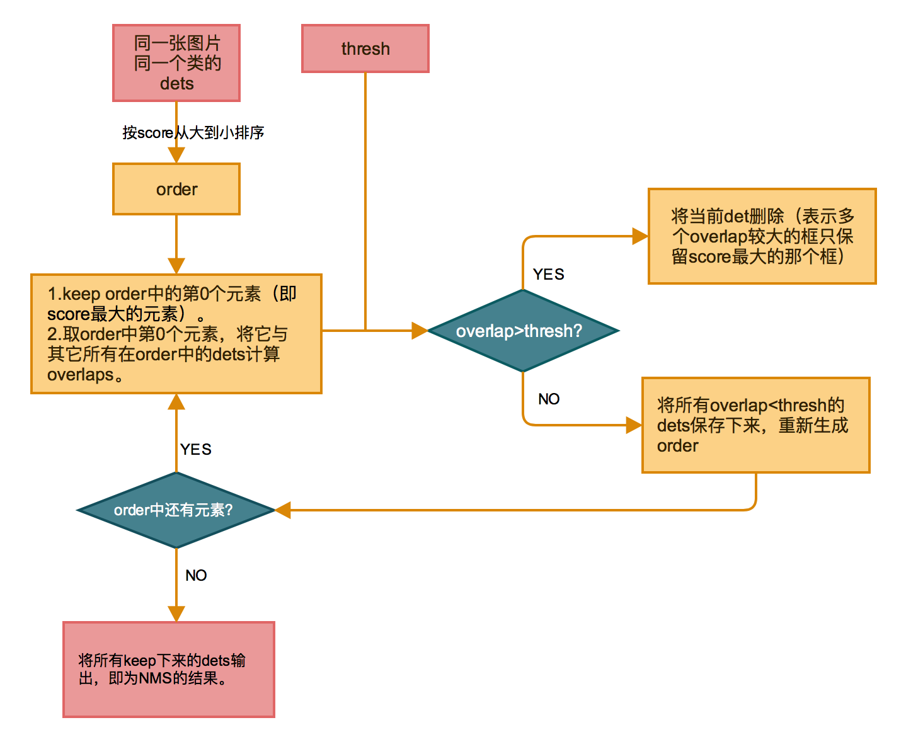
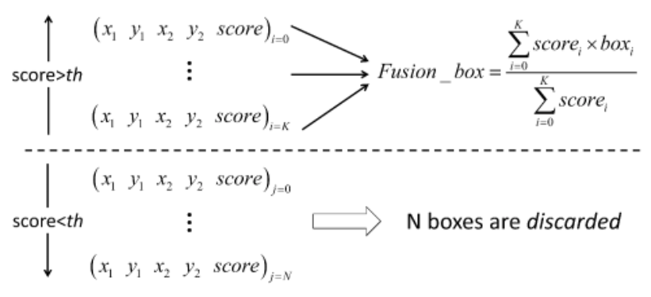
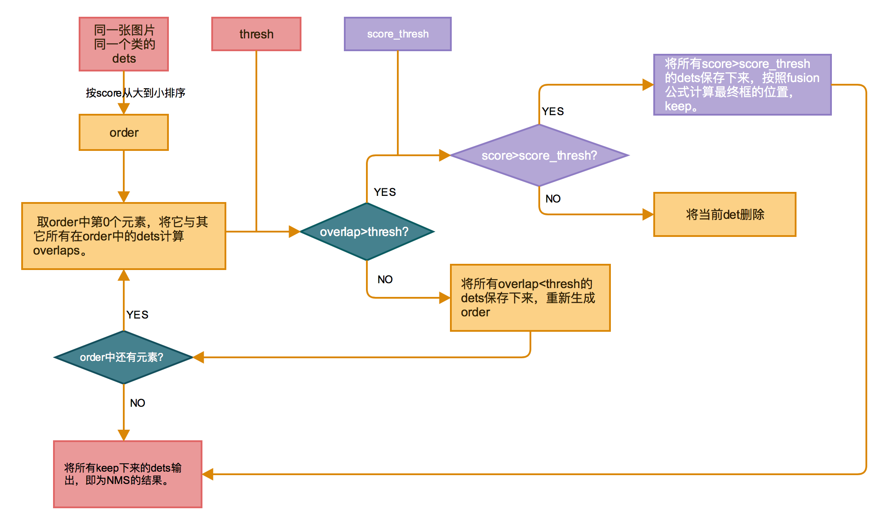

## NMS
NMS(non maximum suppression), 中文名叫非极大值抑制，其作用是抑制冗余的窗口，保留最优的窗口。    
（1）将所有框的得分降序排列，选中最高分及其对应的框。  
（2）遍历其余的框，如果和当前最高分框的重叠面积(IOU)大于一定阈值，我们就将框删除。   
（3）从未处理的框中继续选一个得分最高的，重复上述过程。   

## Box Voting
Box Voting的过程和NMS有相似之处，但是在保留框的时候有所不同。Box Voting在遍历其余框的时候，不是像NMS那样简单地将IOU大于一定阈值的框删除，保留得分最高的框，而是又对score设了一个阈值，对这些框中score大于阈值的框按照下图的计算公式fusion来得到最终的框的位置。

那么BoxVoting的流程如下，其中紫色的框表示相比于NMS新增的部分。

> 在reference【1】中，BoxVoting是和NMS联合使用的。首先在所有得到的detections结果中，按照IOU overlap阈值0.3进行NMS，然后剩余的框再按照IOU overlap阈值0.5， score_thresh=0进行box voting。

## reference
【1】Object detection via a multi-region & semantic segmentation-aware CNN model. Spyros Gidaris, Nikos Komodakis. ICCV, 2015.