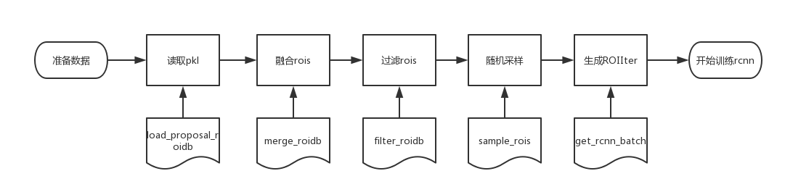

## Test 流水线设计文档
### Mxnet Rcnn 例子中读取rois的流程

包括五个步骤
1. 读取pkl

    框架读取特定格式的包含rois的pkl文件，并将所有保存的rois与改图像中标定的groud-truth 框进行逐个对比，取overlap最大的gt 框的索引作为rois的label。
    若没有任何一个重合则标注为0 表示是背景框。
2. 融合rois
    
    框架中支持读取多个pkl文件的rois，这个步骤是将多个pkl文件中的rois 进行合并，合并的逻辑很简单就是简单的append。
3. 过滤rois

    框架中要求所有的训练图片中没一张必须有一个物体框(前景框)或一个背景框，此过程将不符合该条件的训练图片过滤掉

4. 随机采样

    一般每张训练样本得到的rois的框都会大于config文件中设置的 `config.TRAIN.BATCH_ROIS` 的值，改过程中将根据设定的参数 `config.TRAIN.FG_FRACTION`，`config.TRAIN.FG_THRESH`，`config.TRAIN.BG_THRESH_HI`，`config.TRAIN.BG_THRESH_LO `从每张图片的rois中选择一部分的rois进行训练

5. 生成ROIIter

    该步骤将采样得到的rois 打包成 Mxnet的dataiter 送入最终的训练程序

### 多ROIS RCNN 训练的修改方案
#### 方案1 简单方案 不修改流程

将多种rois 的pkl简单的append 到一起，在随机采样的时候，随机的进行选择，也算添加了多种ROIs

#### 方案2 修改随机采样

将不同种类的rois的信息写入roidb中，并传入随机采样阶段，根据不同种类的rois的信息选择不同的采用方式，得到最终训练用的rois
