## Analyze data
### 功能
针对检测算法，分析以下部分：    
1. 对groundtruth的分析：分析groundtruth boxes的scale(即面积)，aspect ratio(即长宽比)的分布。   
2. 对检测结果的分析(general)：为了衡量检测算法的性能，对比分析各算法的mAP，以及各个cls的AP，AR。    
3. 对检测结果的分析(detailed)：分析检测算法对不同scale，aspect ratio的鲁棒性, 即在各个scale／aspect ratio下算法的mAP，以及各个cls的AP，AR。    
4. 对上述分析结果的可视化.     

### 代码流程：
**黄色分支为原fast rcnn代码中执行test并输出mAP的流程.**  
1. test\_rcnn: test的入口    
2. pred\_eval：对test dataset进行物体检测，输出all\_boxes. all\_boxes格式为：   
`all_boxes[cls][image] = N\*5 (x1, y1, x2, y2, score)`    
3. evaluate\_detections：评估入口   
4. write\_pascal\_results: 将all\_boxes按cls保存到txt中，每行格式为   
`image_idx, score, x1, y1, x2, y2`     
5. do\_python\_eval：按cls输入到voc\_eval中，统筹管理评估过程。  
6. voc\_eval：计算每个类别的recall, precision, ap, ar。

**绿色分支为新增的detailed的分析过程，主要实现在不同scale/aspect ratio下计算mAP，以及各个cls的AP，AR。**     
1. do\_python\_eval\_detailed：定义好不同的scale／aspect ratio区间，在每个区间内按cls输入到voc\_eval中。  
2. voc\_eval\_detailed：筛选groundtruth boxes和detection results，使其满足scale／aspect ratio属于指定的区间。对于满足要求的数据，计算每个类别的recall, precision, ap, ar。   
3. draw\_map / draw\_ap: 绘制不同cls，不同scale/aspect ratio下的mAP／AP的柱状图。
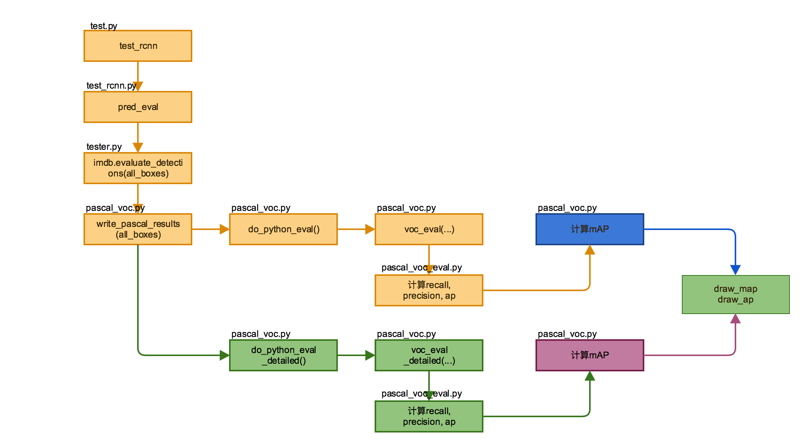

### 输出结果
#### 1. groundtruth box statistics:
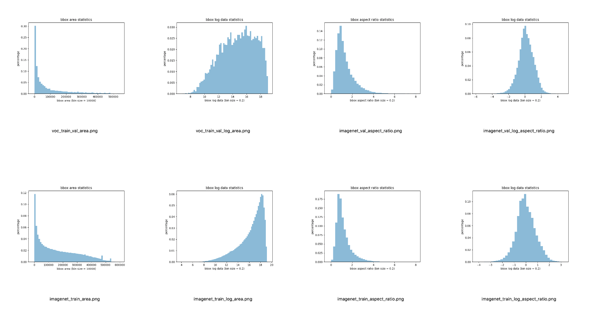
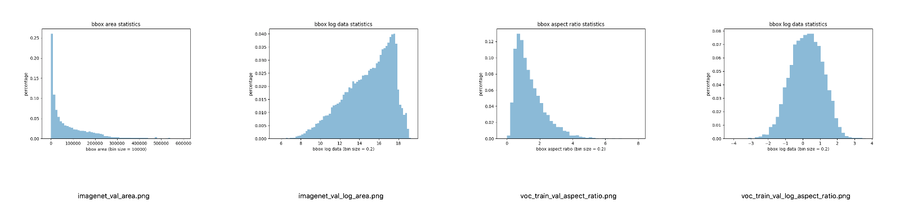
从上图中可以看出groundtruth boxes的scale(即面积)和aspect ratio的基本分布。  
对于scale而言，通常在fast rcnn中使用的scale为8，16，32，对应于原图即检测框的边长为128，256，512. 在计算mAP时，以IOU overlap>0.5为阈值筛选检测框，则上述三个尺度分别能够检测到的面积区间为：[128\*128/2,128\*128\*2], [256\*256/2,256\*256\*2], [512\*512/2, 512\*512\*2],取log2则为[13,15],[15,17],[17,19]. 因此以下在统计实验结果时为区分以上区间，共分为5组：[<13],[13,15],[15,17],[17,19],[>19]。   
对于aspect ratio而言，通常取0.5，1，2，取log2为-1，0，1.以下在统计时共分为6组:[<-2],[-2,-1],[-1,0],[0,1],[1,2],[>2]。

#### 2. detection result statistics:
1. constrained positive negative ratio:      

mAP for all  | 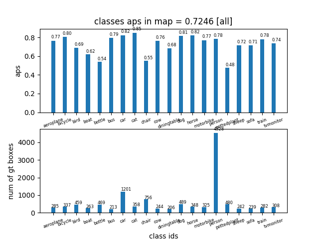|
------------- |---------|
mAP for log\_area  | |
mAP for log\_aspect\_ratio | 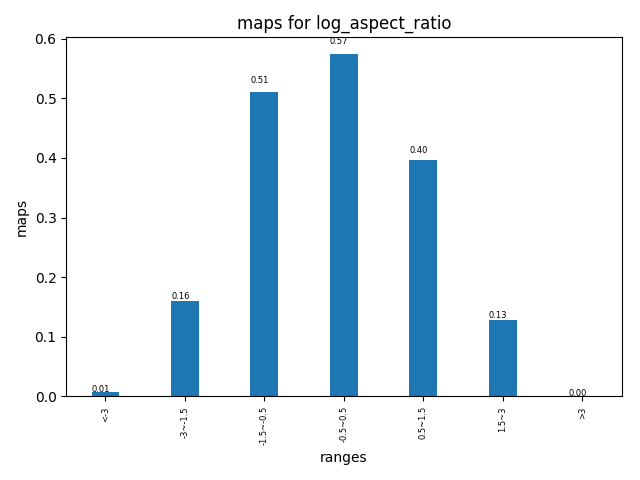|

AP in log\_area range [<13] ||
----|-----|
AP in log\_area range [13,15] |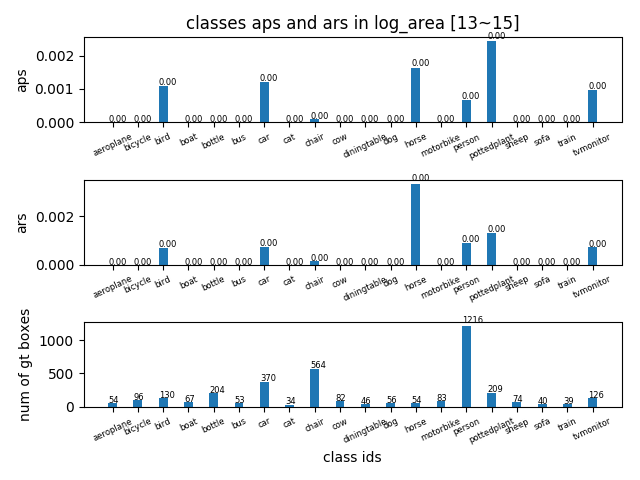|
AP in log\_area range [15,17] |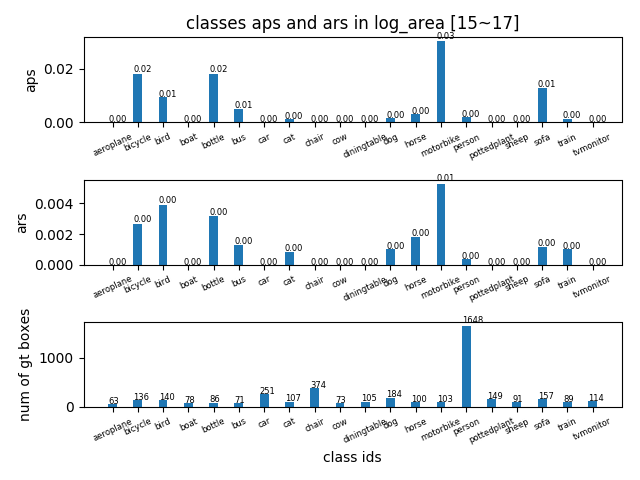|
AP in log\_area range [17,19] |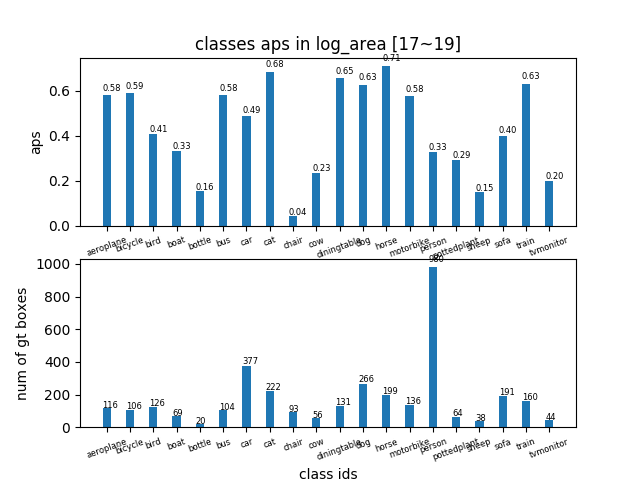|
AP in log\_area range [>19] |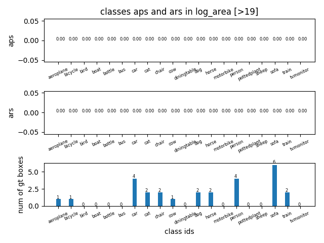|

AP in log\_aspect_ratio range [<-2] |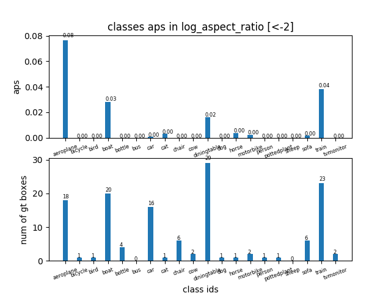|
----|-----|
AP in log\_aspect_ratio range [-2,-1] |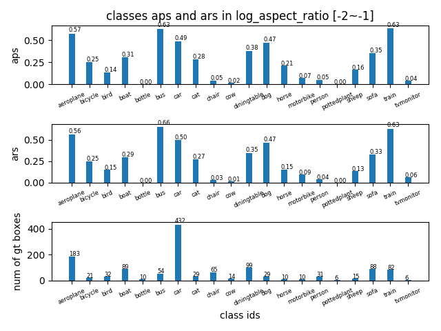|
AP in log\_aspect_ratio range [-1,0] |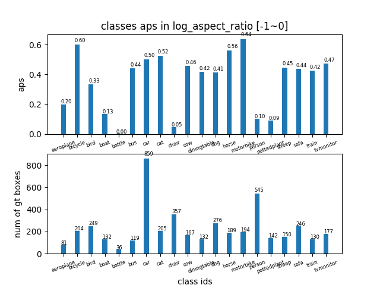|
AP in log\_aspect_ratio range [0,1] |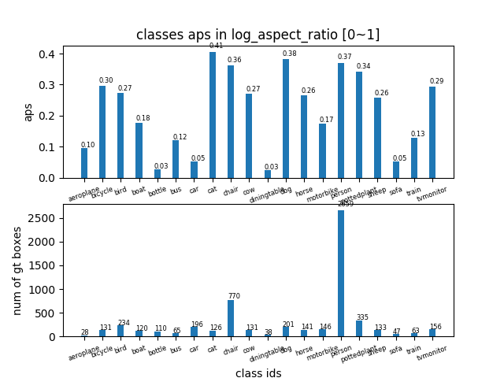|
AP in log\_aspect_ratio range [1,2] |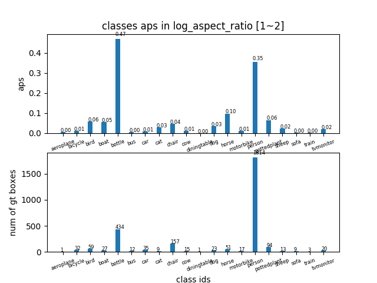|
AP in log\_aspect_ratio range [>2] |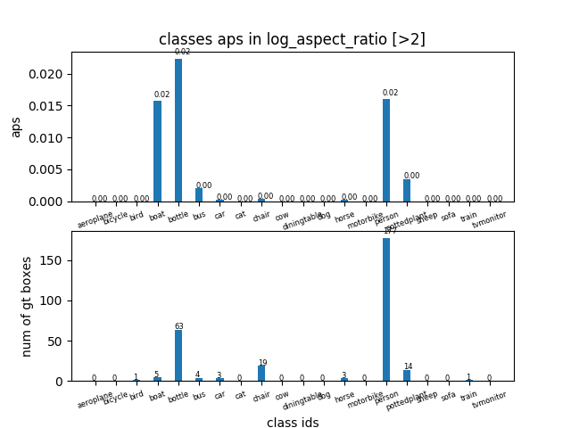|

