## Performance Analysis
关于performance analysis的功能／代码流程等详细内容参考[VOC的Performance Analysis](performance_analysis_voc.md)。

### 输出结果
#### 1. groundtruth box statistics:

从上图中可以看出groundtruth boxes的scale(即面积)和aspect ratio的基本分布。  
对于scale而言，通常在fast rcnn中使用的scale为8，16，32，对应于原图即检测框的边长为128，256，512. 在计算mAP时，以IOU overlap>0.5为阈值筛选检测框，则上述三个尺度分别能够检测到的面积区间为：[128\*128/2,128\*128\*2], [256\*256/2,256\*256\*2], [512\*512/2, 512\*512\*2],取log2则为[13,15],[15,17],[17,19]. 因此以下在统计实验结果时为区分以上区间，共分为5组：[<13],[13,15],[15,17],[17,19],[>19]。   
对于aspect ratio而言，通常取0.5，1，2，取log2为-1，0，1.以下在统计时共分为6组:[<-2],[-2,-1],[-1,0],[0,1],[1,2],[>2]。

#### 2. detection result statistics (resnet101-imagenet full)
#### (1) MAPs
tag| result | 
------------- |---------|
mAP for all  | 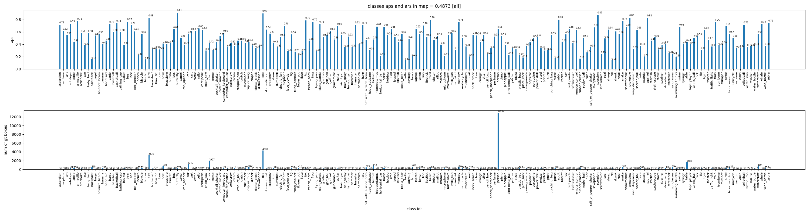|
mAP for log\_area  | 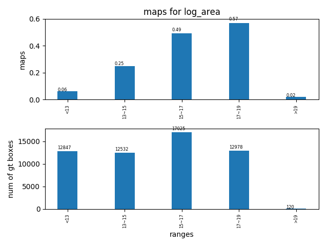|
mAP for log\_aspect\_ratio | 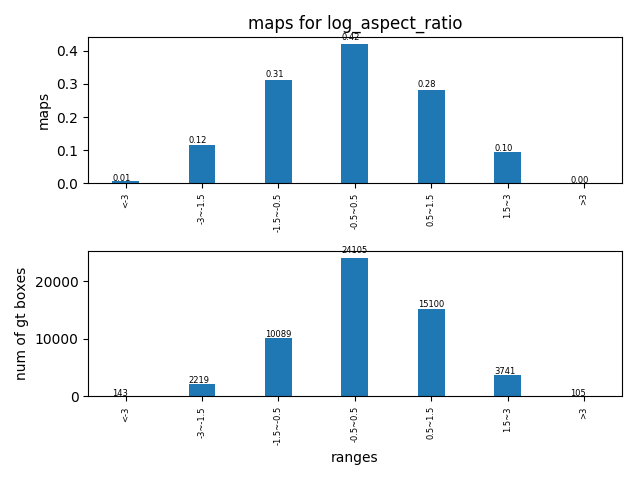| 

#### (2) APs for area
tag| result |
----|-----|
AP in log\_area range [<13] |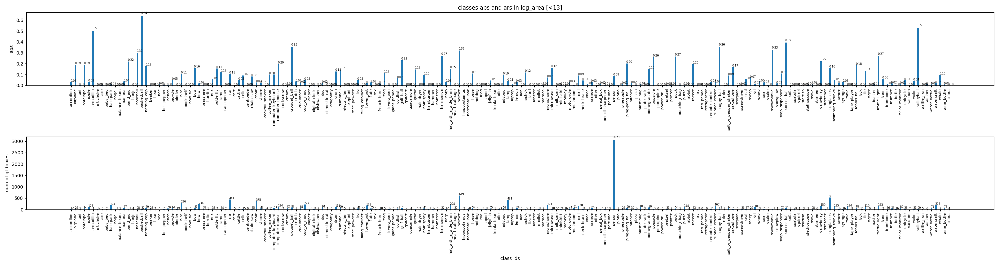| 
AP in log\_area range [13,15] |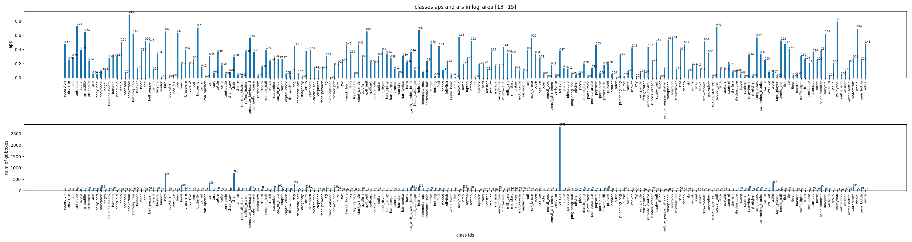| 
AP in log\_area range [15,17] |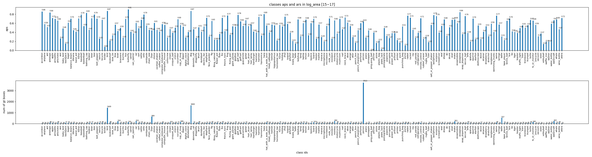|
AP in log\_area range [17,19] |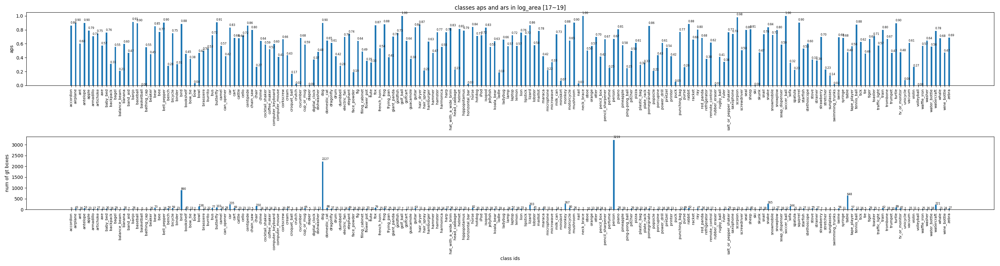|
AP in log\_area range [>19] |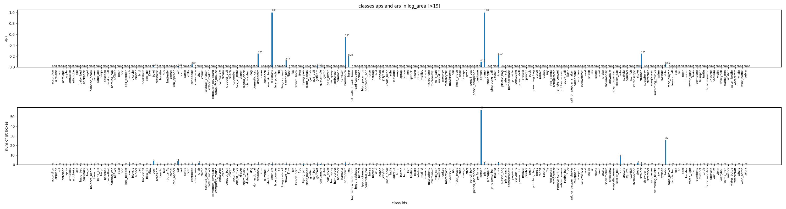| 

#### (3) APs for aspect ratio
tag| result | 
----|-----|
AP in log\_aspect_ratio range [<-3] |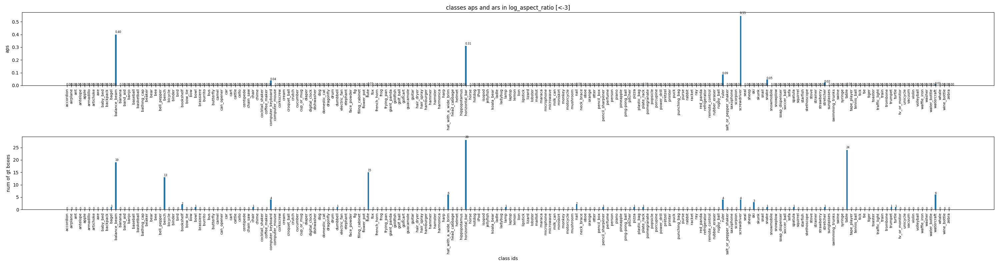|
AP in log\_aspect_ratio range [-3,-1.5] ||
AP in log\_aspect_ratio range [-1.5,-0.5] |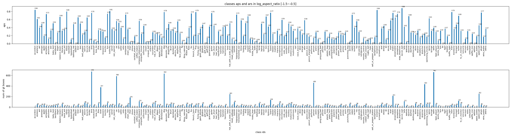|
AP in log\_aspect_ratio range [-0.5,0.5] |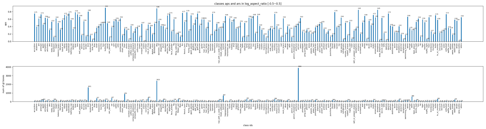|
AP in log\_aspect_ratio range [0.5,1.5] |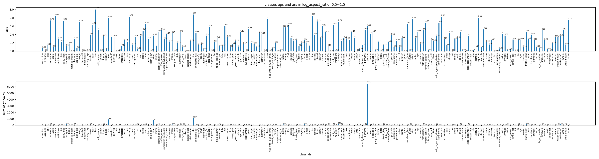|
AP in log\_aspect_ratio range [1.5,3] |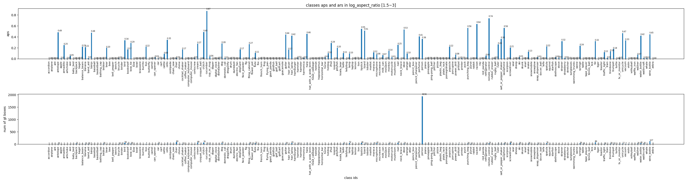|
AP in log\_aspect_ratio range [>3] |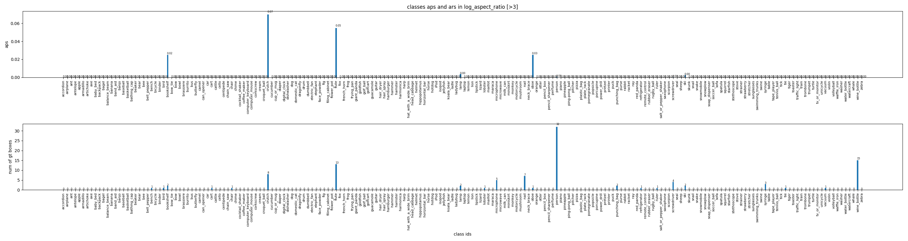|

