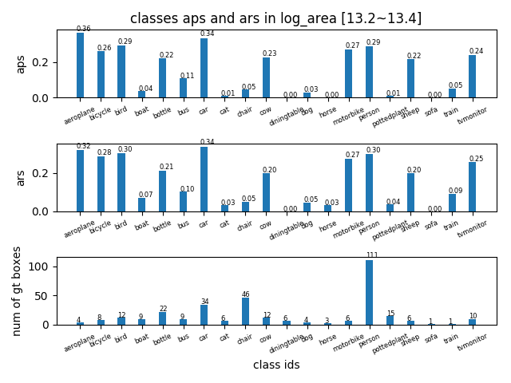
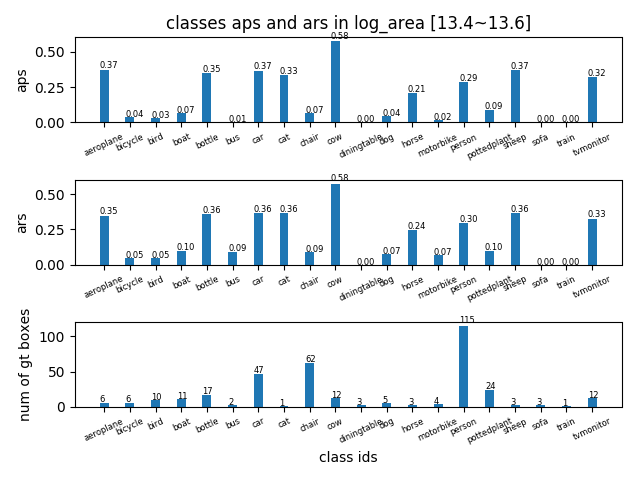
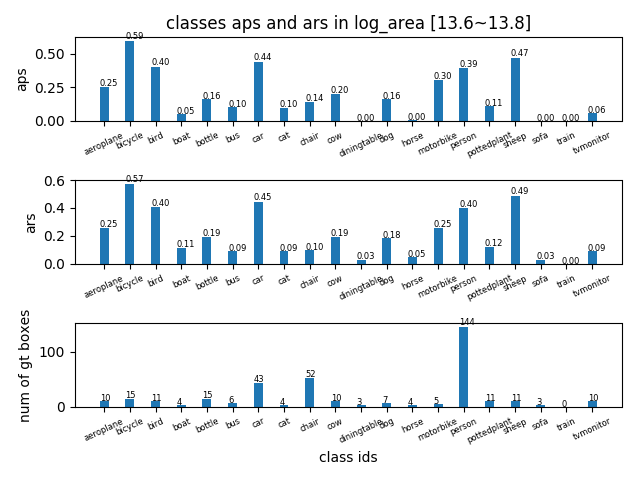
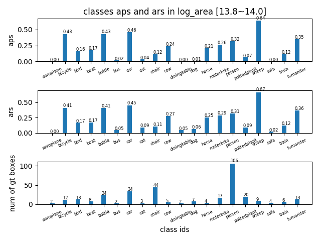
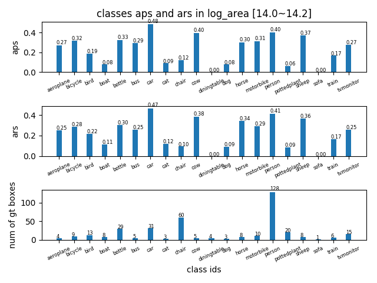
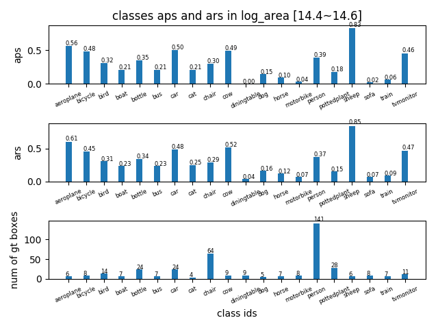
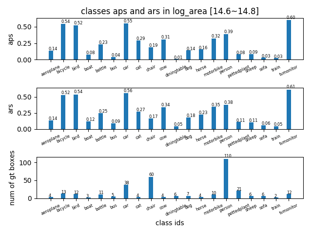
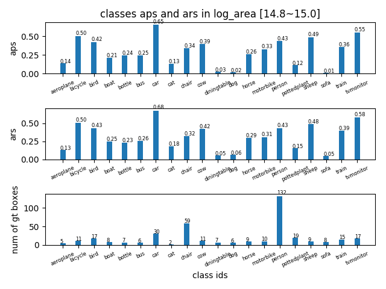

## AP in log_area range [13~15] -detailed
tag| result |
----|-----|
AP in log\_area range [13,13.2] ||
AP in log\_area range [13.2,1313.4] ||
AP in log\_area range [13.4,13.6] ||
AP in log\_area range [13.6,13.8] ||
AP in log\_area range [13.8,14.0] ||
AP in log\_area range [14.0,14.2] ||
AP in log\_area range [14.2,14.4] ||
AP in log\_area range [14.4,14.6] ||
AP in log\_area range [14.6,14.8] ||
AP in log\_area range [14.8,15.0] ||