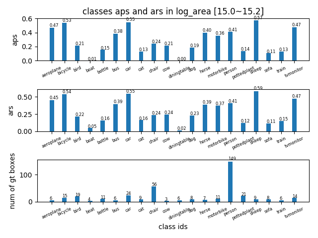
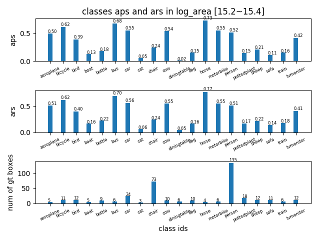
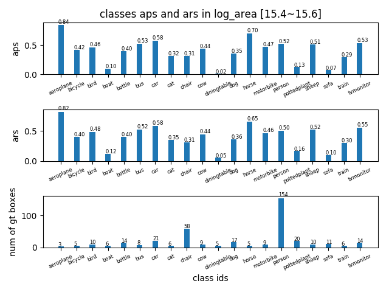
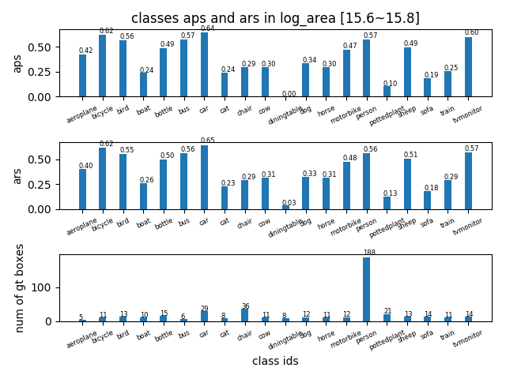
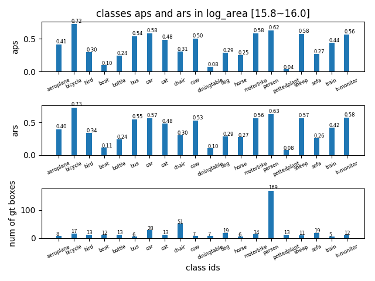
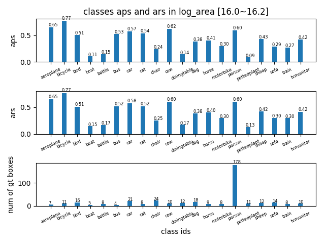
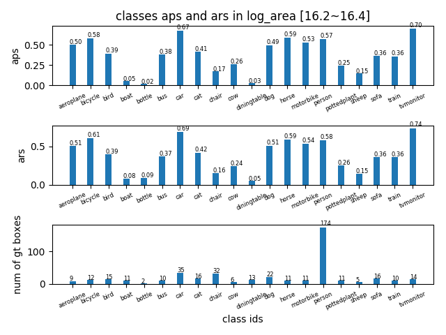
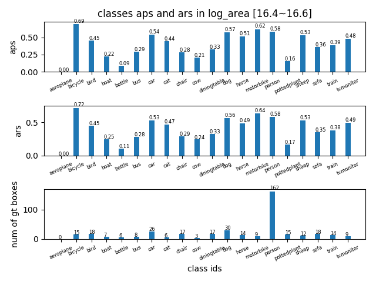
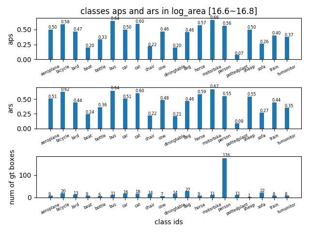
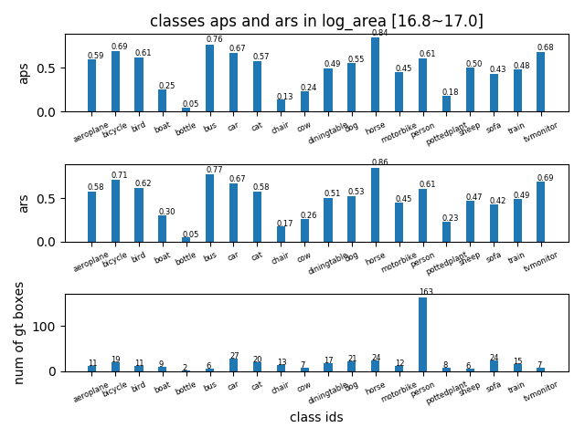

## AP in log_area range [15~17] -detailed
tag| result |
----|-----|
AP in log\_area range [15,15.2] ||
AP in log\_area range [15.2,15.4] ||
AP in log\_area range [15.4,15.6] ||
AP in log\_area range [15.6,15.8] ||
AP in log\_area range [15.8,16.0] ||
AP in log\_area range [16.0,16.2] ||
AP in log\_area range [16.2,16.4] ||
AP in log\_area range [16.4,16.6] ||
AP in log\_area range [16.6,16.8] ||
AP in log\_area range [16.8,17.0] ||