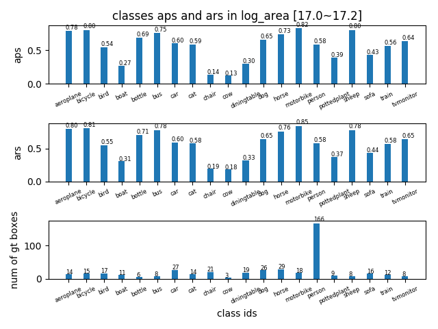
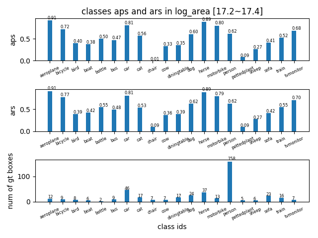
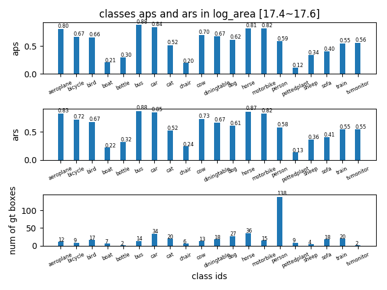
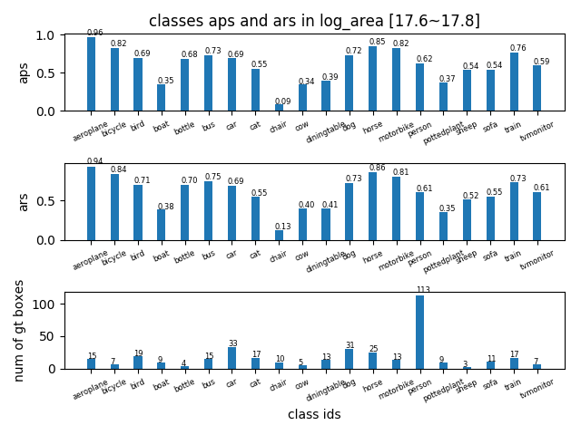
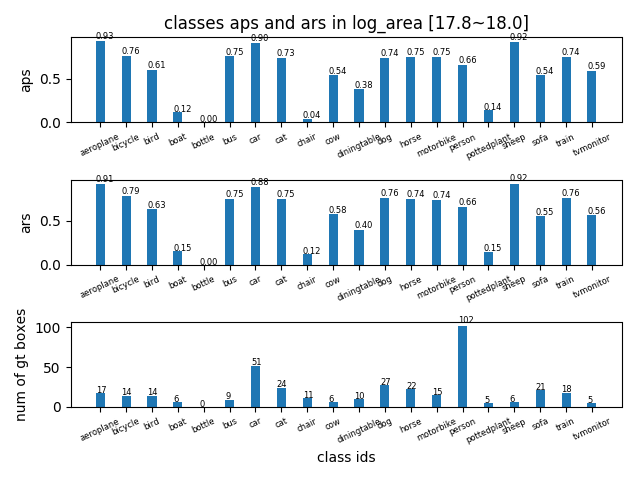
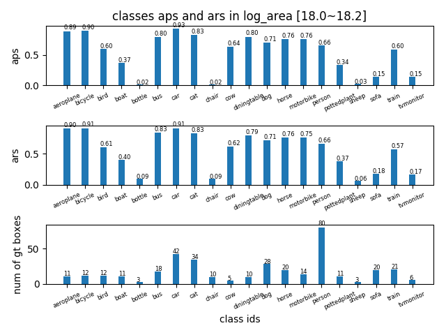
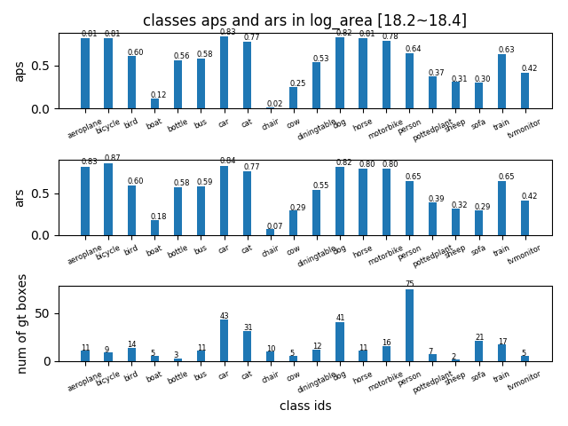
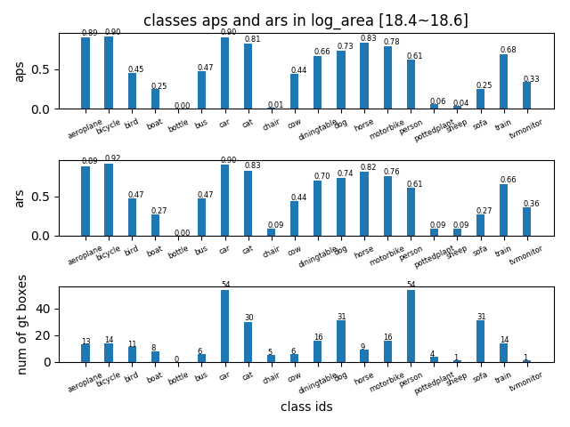
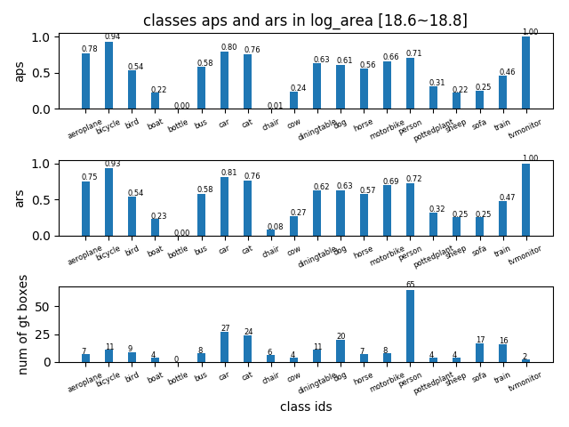

## AP in log_area range [17~19] -detailed
tag| result |
----|-----|
AP in log\_area range [17,17.2] ||
AP in log\_area range [17.2,17.4] ||
AP in log\_area range [17.4,17.6] ||
AP in log\_area range [17.6,17.8] ||
AP in log\_area range [17.8,18.0] ||
AP in log\_area range [18.0,18.2] ||
AP in log\_area range [18.2,18.4] ||
AP in log\_area range [18.4,18.6] ||
AP in log\_area range [18.6,18.8] ||