## AP in log_area range [<13] -detailed
tag| result |
----|-----|
AP in log\_area range [<8] |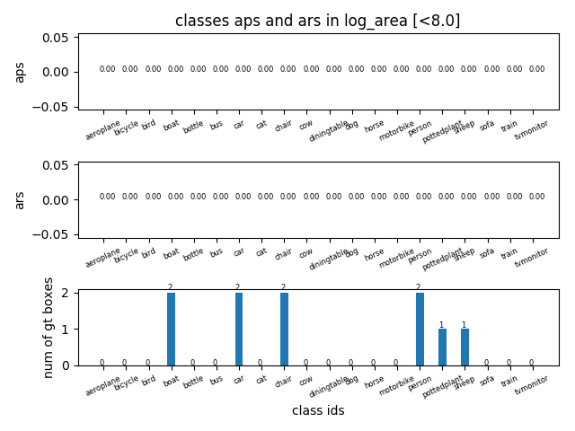|
AP in log\_area range [8,8.2] |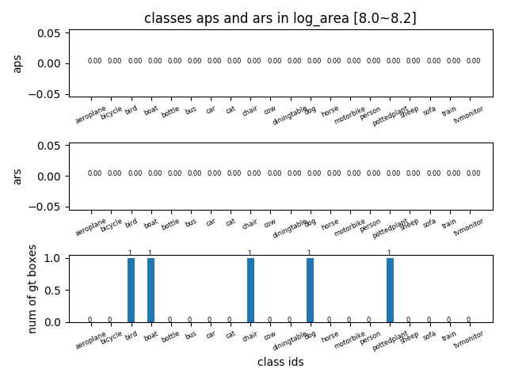|
AP in log\_area range [8.2,8.4] |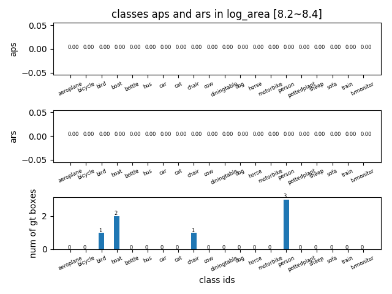|
AP in log\_area range [8.4,8.6] |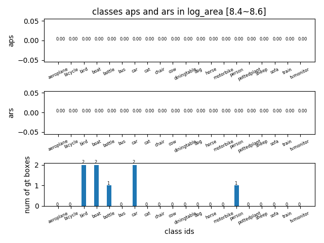|
AP in log\_area range [8.6,8.8] |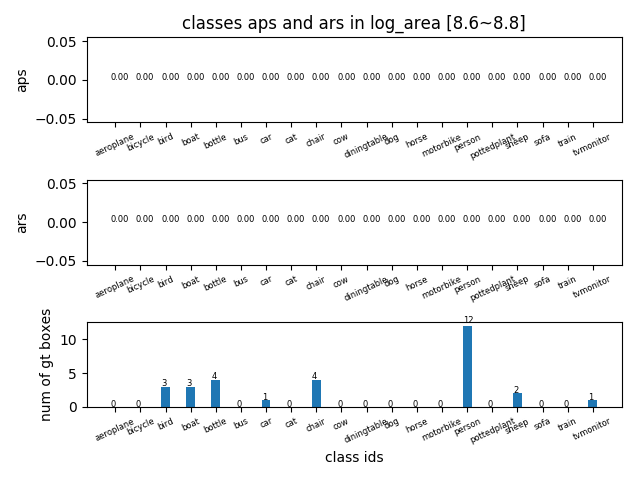|
AP in log\_area range [8.8,9.0] |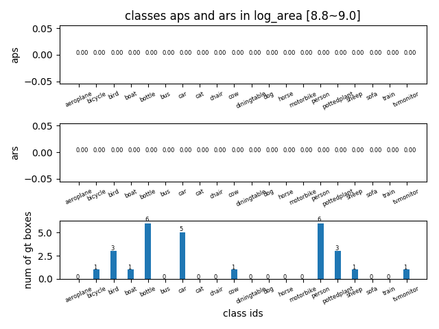|
AP in log\_area range [9.0,9.2] |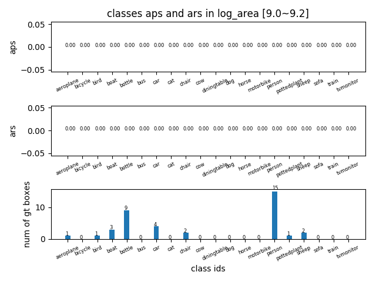|
AP in log\_area range [9.2,9.4] |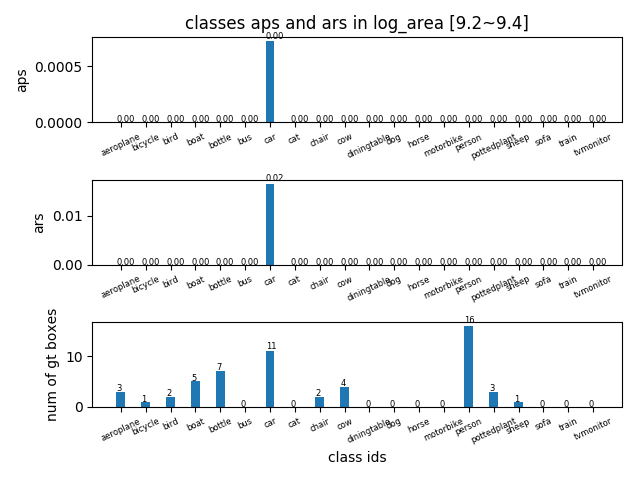|
AP in log\_area range [9.4,9.6] |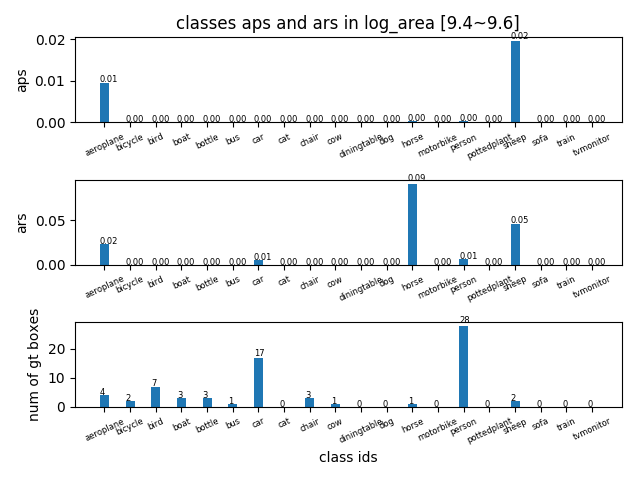|
AP in log\_area range [9.6,9.8] |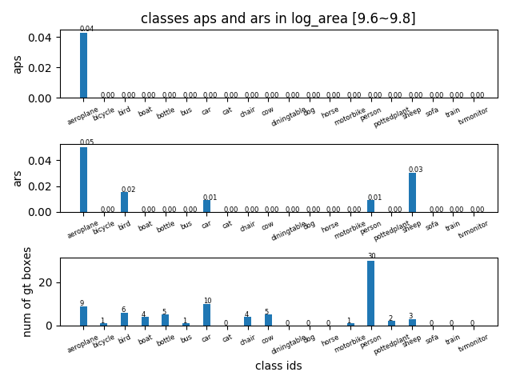|
AP in log\_area range [9.8,10.0] |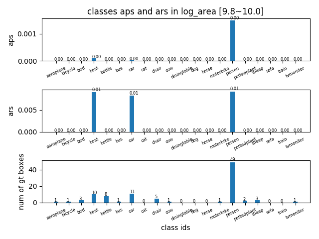|
AP in log\_area range [10.0,10.2] |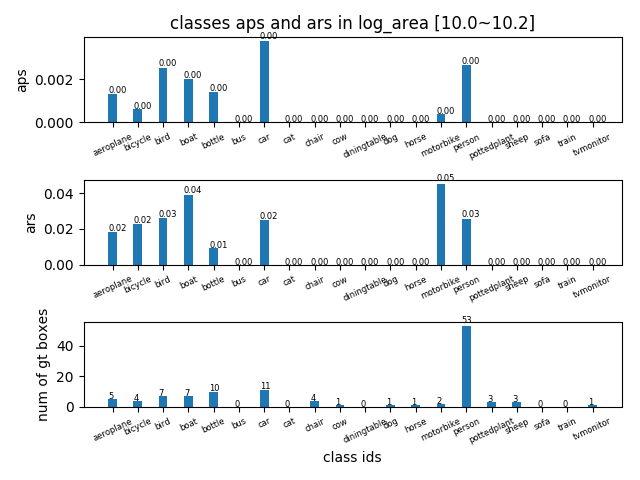|
AP in log\_area range [10.2,10.4] |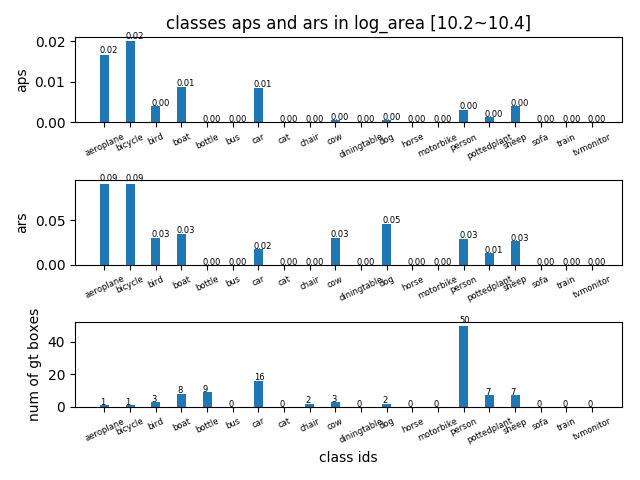|
AP in log\_area range [10.4,10.6] |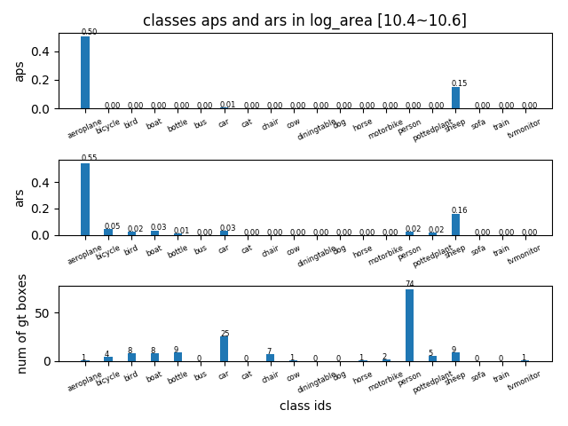|
AP in log\_area range [10.6,10.8] |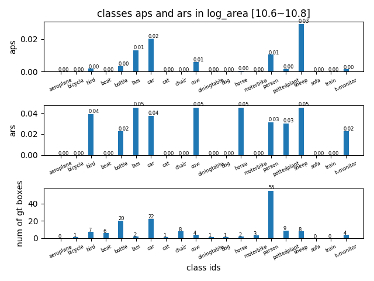|
AP in log\_area range [10.8,11.0] ||
AP in log\_area range [11.0,11.2] |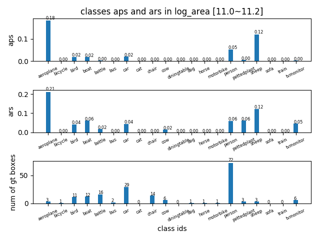|
AP in log\_area range [11.2,11.4] ||
AP in log\_area range [11.4,11.6] |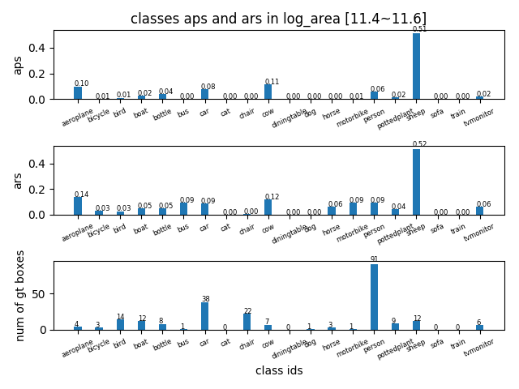|
AP in log\_area range [11.6,11.8] |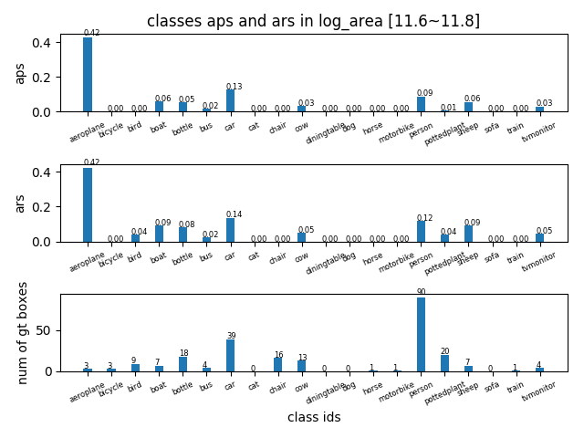|
AP in log\_area range [11.8~12.0] |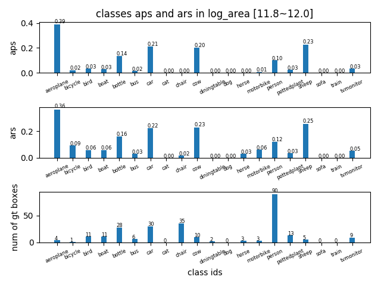|
AP in log\_area range [12.0,12.2] |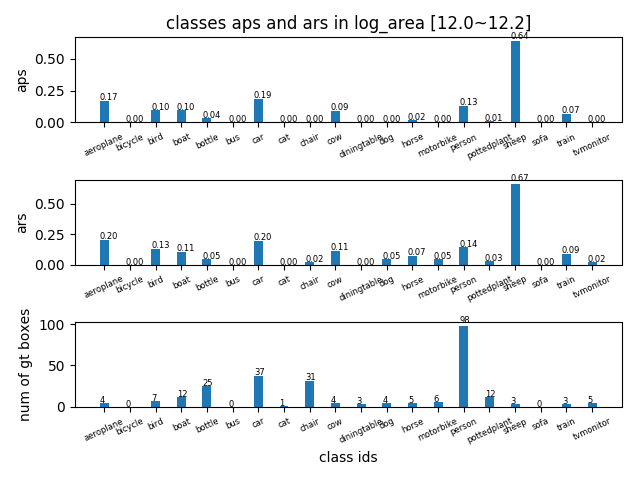|
AP in log\_area range [12.2,12.4] |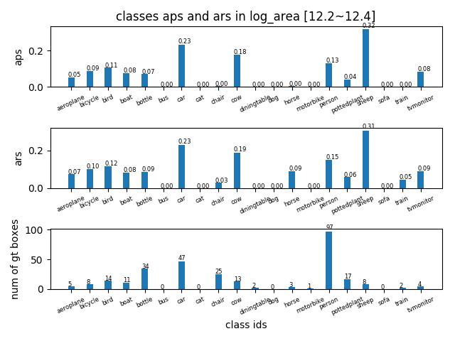|
AP in log\_area range [12.4,12.6] |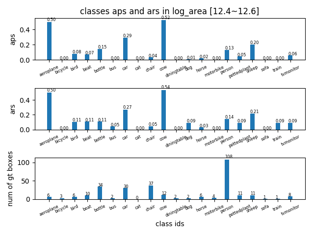|
AP in log\_area range [12.6,12.8] ||
AP in log\_area range [12.8,13.0] |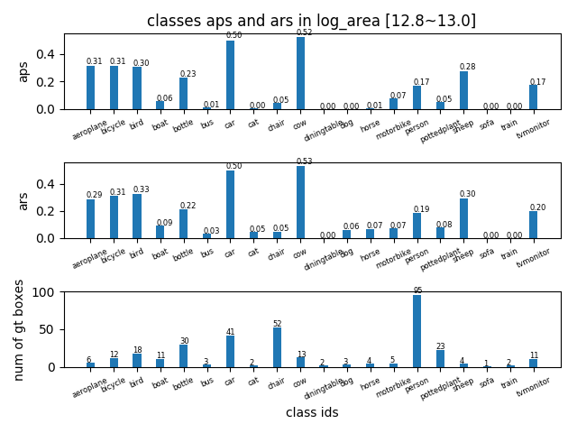|