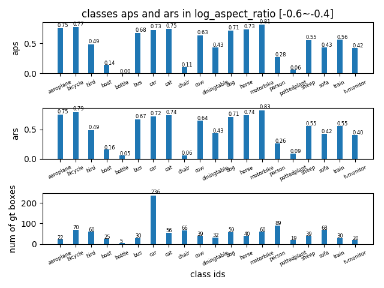
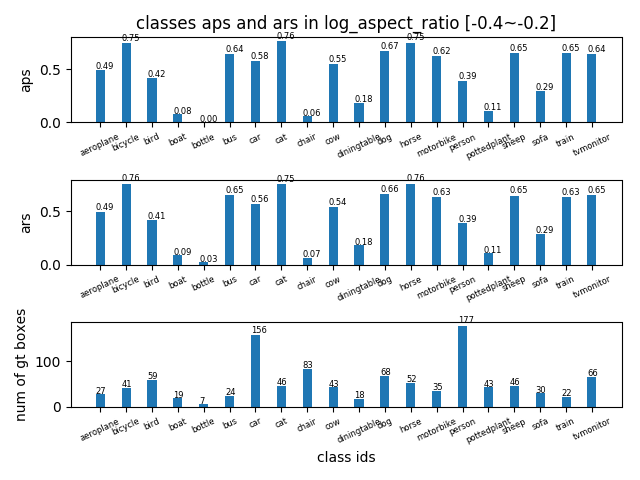
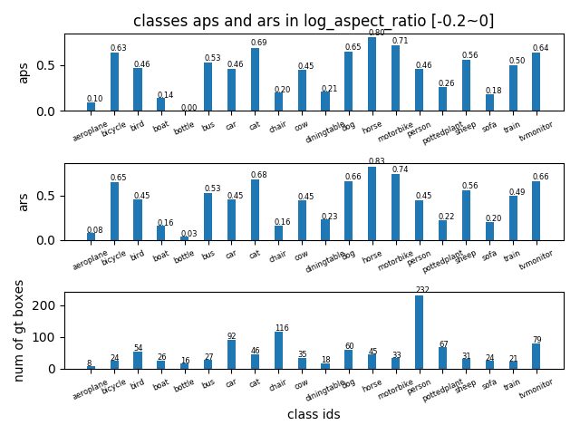
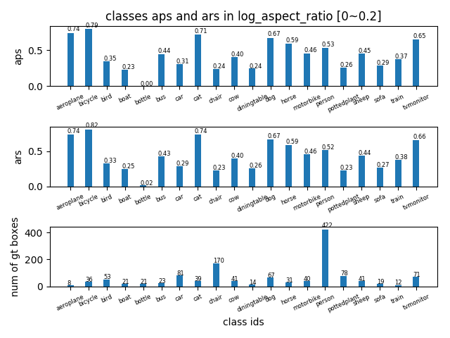
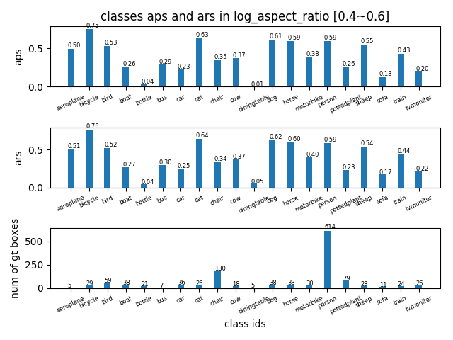

## AP in log_aspect_ratio range [-0.6~0.6] -detailed
tag| result |
----|-----|
AP in log\_aspect_ratio range [-0.6,-0.4] ||
AP in log\_aspect_ratio range [-0.4,-0.2] ||
AP in log\_aspect_ratio range [-0.2,0] ||
AP in log\_aspect_ratio range [0,0.2] ||
AP in log\_aspect_ratio range [0.2,0.4] ||
AP in log\_aspect_ratio range [0.4,0.6] ||