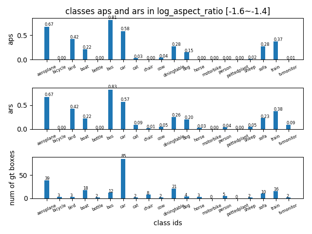
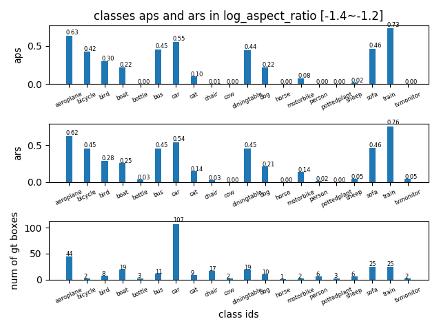
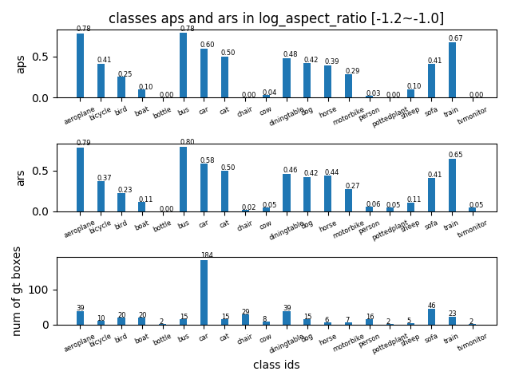
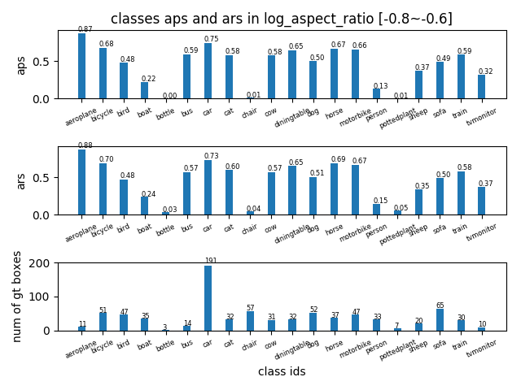

## AP in log_aspect_ratio range [-1.6~-0.6] -detailed
tag| result |
----|-----|
AP in log\_aspect_ratio range [-1.6,-1.4] ||
AP in log\_aspect_ratio range [-1.4,-1.2] ||
AP in log\_aspect_ratio range [-1.2,-1.0] ||
AP in log\_aspect_ratio range [-1.0,-0.8] ||
AP in log\_aspect_ratio range [-0.8,-0.6] ||