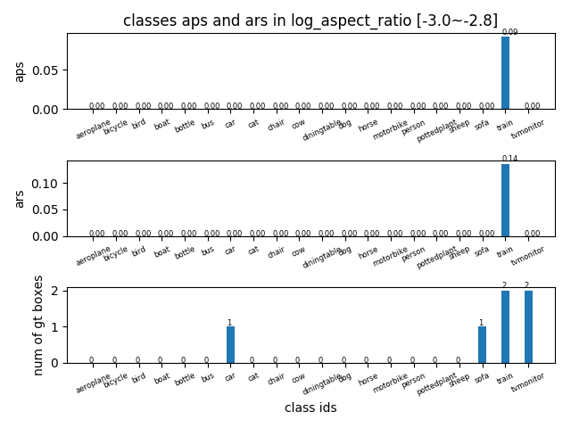
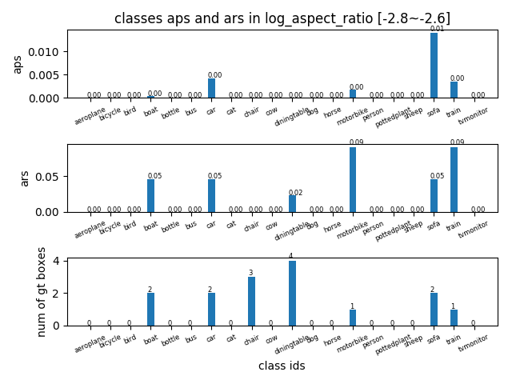
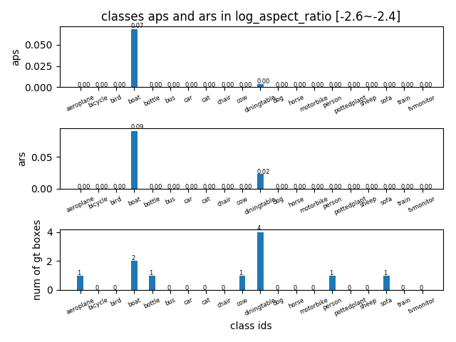
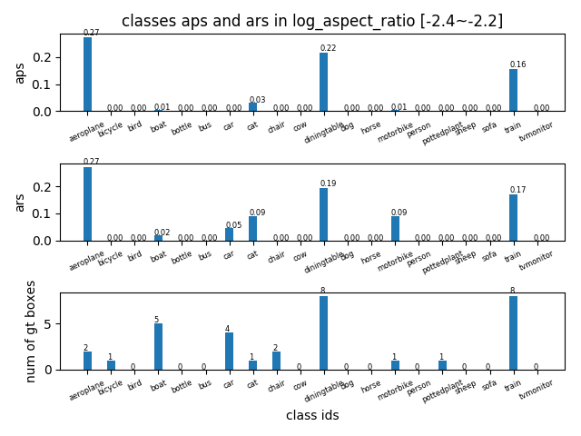
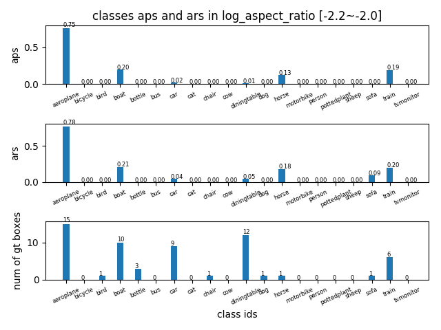
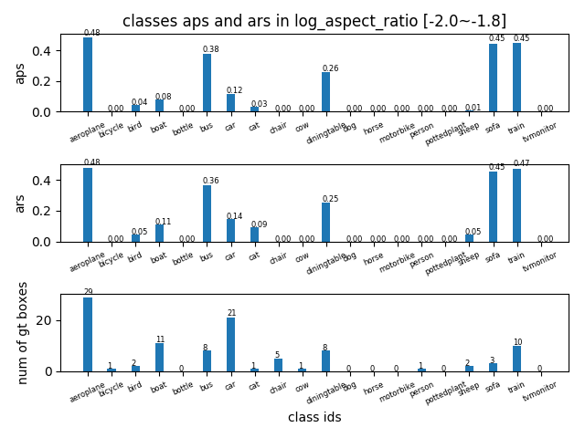

## AP in log_aspect_ratio range [-3~-1.6] -detailed
tag| result |
----|-----|
AP in log\_aspect_ratio range [-3,-2.8] ||
AP in log\_aspect_ratio range [-2.8,-2.6] ||
AP in log\_aspect_ratio range [-2.6,-2.4] ||
AP in log\_aspect_ratio range [-2.4,-2.2] ||
AP in log\_aspect_ratio range [-2.2,-2.0] ||
AP in log\_aspect_ratio range [-2.0,-1.8] ||
AP in log\_aspect_ratio range [-1.8,-1.6] ||