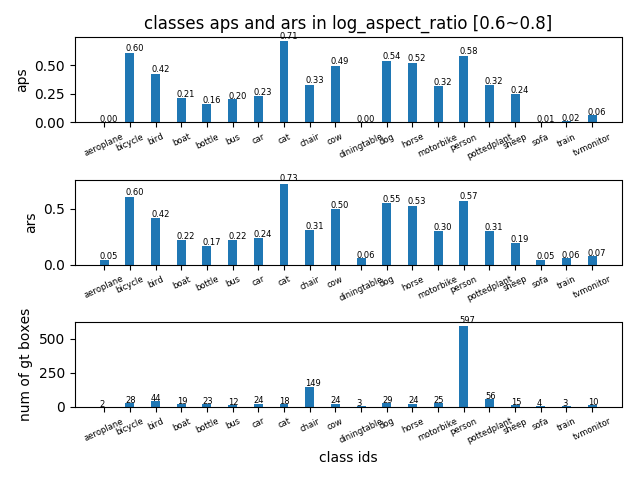
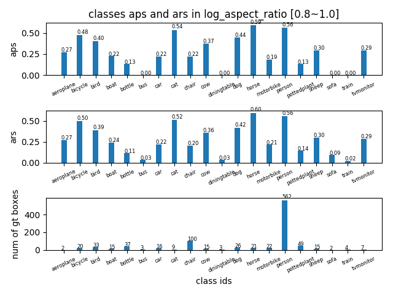
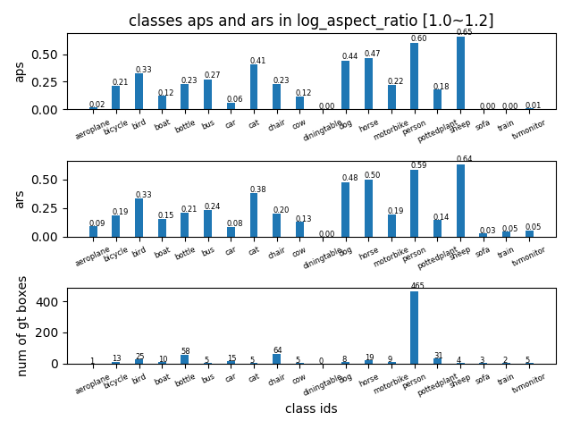
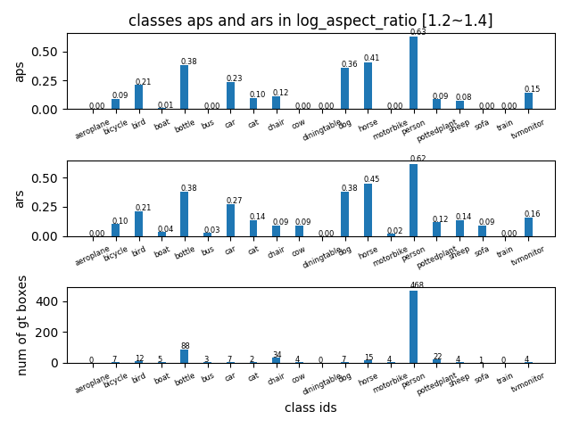

## AP in log_aspect_ratio range [0.6~1.4] -detailed
tag| result |
----|-----|
AP in log\_aspect_ratio range [0.6,0.8] ||
AP in log\_aspect_ratio range [0.8,1.0] ||
AP in log\_aspect_ratio range [1.0,1.2] ||
AP in log\_aspect_ratio range [1.2,1.4] ||