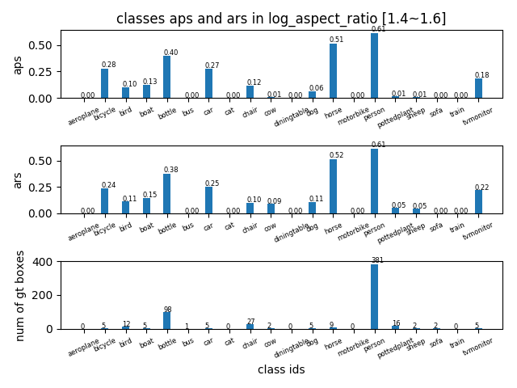
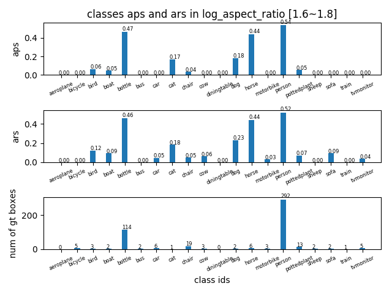
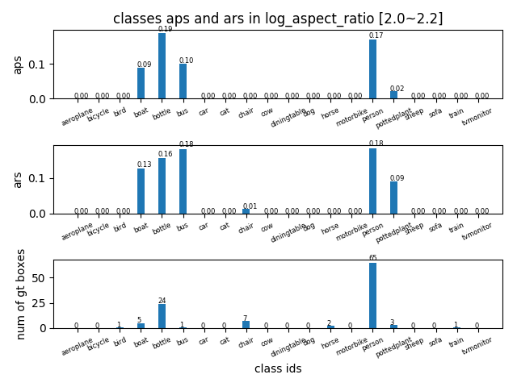
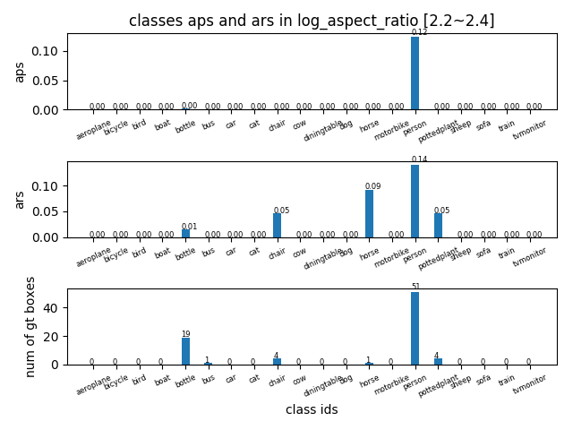
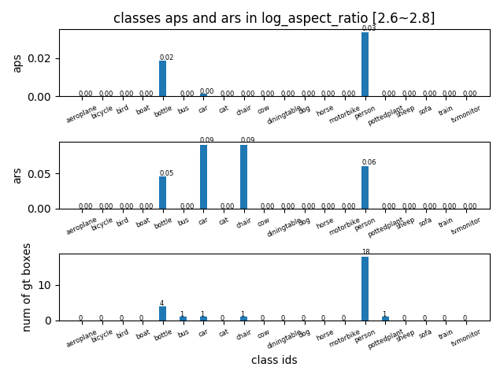

## AP in log_aspect_ratio range [1.4~3] -detailed
tag| result |
----|-----|
AP in log\_aspect_ratio range [1.4,1.6] ||
AP in log\_aspect_ratio range [1.6,1.8] ||
AP in log\_aspect_ratio range [1.8,2.0] ||
AP in log\_aspect_ratio range [2.0,2.2] ||
AP in log\_aspect_ratio range [2.2,2.4] ||
AP in log\_aspect_ratio range [2.4,2.6] ||
AP in log\_aspect_ratio range [2.6,2.8] ||