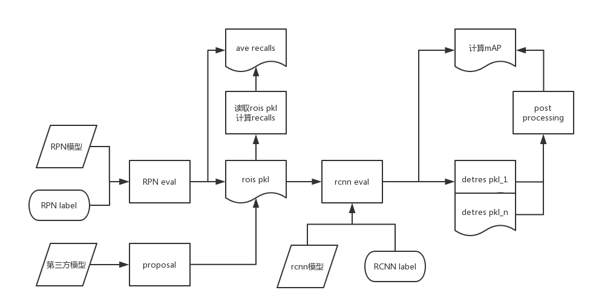

## Test 流水线设计文档
### 总体流程图

需要开发的算法模块包括：
1. rpneval
2. 读取rois pkl 计算recalls(未完成)
3. rcnn eval(未完成)
4. post processing(未完成)

### rpneval 
使用mxnet rcnn 框架中 testrpn代码，输入的参数为

|参数|含义|
|----|----|
|--network|输入的模型类型比如resnet|
|--dataset|测试的样本类型voc,coco或者imagenet 一般为imagenet|
|--image_set|表示测试集train val 或者test，一般为val|
|--prefix|模型文件的前缀|
|--epoch|表示第几个epoch|
|--gpu|gpuid|
|--thresh|rpn最低的score阈值|

调用的例子：

```
#!/usr/bin/env bash
# 网络模型：resnet训练的第7轮的结果
# 数据集：imagenet DET的val数据集
LOG=eval_proposal_imagenet_baseline.log

rm -rf ${LOG}

export MXNET_CUDNN_AUTOTUNE_DEFAULT=0
export PYTHONUNBUFFERED=1

nohup python -m rcnn.tools.test_rpn --network resnet                        \
                                  --dataset imagenet           \
                                  --image_set val                           \
                                  --prefix model/e2e          \
                                  --gpu 2                                   \
                                  --epoch 7                                \
                                  >${LOG} 2>&1 &
```

log中可以查看average recall等情况，同时会保存一个pkl文件，文件路径： rpn_data/imagenet(dataset)_val(image_set)_rpn.pkl

### 读取rois pkl 计算recalls
另外写一个工具 输入参数定义如下

|参数|含义|
|----|----|
|--pklfile|输入的pkl文件|
|--dataset|测试的样本类型voc,coco或者imagenet 一般为imagenet|
|--image_set|表示测试集train val 或者test，一般为val|

调用例子：

```
#!/usr/bin/env bash
# 网络模型：resnet训练的第7轮的结果
# 数据集：imagenet DET的val数据集
LOG=eval_proposal_imagenet_baseline.log

rm -rf ${LOG}

export MXNET_CUDNN_AUTOTUNE_DEFAULT=0
export PYTHONUNBUFFERED=1

nohup python -m rcnn.tools.test_rois --pklfile rrpn_data/deepmask_pkl                        \
                                  --dataset imagenet           \
                                  --image_set val                           \
                                  >${LOG} 2>&1 &
```

同样在log中查看average recall等信息

### rcnn eval

使用mxnet rcnn框架中的testrcnn代码，输入参数为：

|参数|含义|
|----|----|
|--network|输入的模型类型比如resnet|
|--dataset|测试的样本类型voc,coco或者imagenet 一般为imagenet|
|--image_set|表示测试集train val 或者test，一般为val|
|--prefix|模型文件的前缀|
|--epoch|表示第几个epoch|
|--gpu|gpuid|
|--thresh|rcnn最低的score阈值|

读取默认路径下的rois的pkl文件.
调用例子：

```
#!/usr/bin/env bash
# 网络模型：resnet训练的第7轮的结果
# 数据集：imagenet DET的val数据集
LOG=eval_proposal_imagenet_baseline.log

rm -rf ${LOG}

export MXNET_CUDNN_AUTOTUNE_DEFAULT=0
export PYTHONUNBUFFERED=1

nohup python -m rcnn.tools.test_rcnn --network resnet                        \
                                  --dataset imagenet           \
                                  --image_set val                           \
                                  --prefix model/e2e          \
                                  --gpu 2                                   \
                                  --epoch 7                                \
                                  >${LOG} 2>&1 &
```

log中可以查看mAP等情况，同时会保存最终的检测结果的一个pkl文件.文件路径： rcnn_data/imagenet(dataset)_val(image_set)_rcnn.pkl

### post processing(未完成)
另外写一个后处理的工具，读取一个或者多个检测结果的pkl文件，做融合或者boxvoting。输入参数为：

|参数|含义|
|----|----|
|--pklfileIn|输入的pkl文件列表，用 `，`分割|
|--pklfileOut|输出的pkl文件名|
|--dataset|测试的样本类型voc,coco或者imagenet 一般为imagenet|
|--image_set|表示测试集train val 或者test，一般为val|

调用例子：

```
#!/usr/bin/env bash
# 网络模型：resnet训练的第7轮的结果
# 数据集：imagenet DET的val数据集
LOG=eval_proposal_imagenet_baseline.log

rm -rf ${LOG}

export MXNET_CUDNN_AUTOTUNE_DEFAULT=0
export PYTHONUNBUFFERED=1

nohup python -m rcnn.tools.post_processing --pklfileIn rcnn_data/rcnn_v1_pkl,rcnn_data/rcnn_v2.pkl                        \
                                  --pklfileOut rcnn_data/rcnn_merge.pkl           \
                                  --dataset imagenet           \
                                  --image_set val                           \
                                  >${LOG} 2>&1 &
```


log中可以查看mAP等情况，同时会保存最终的检测结果的一个pkl文件在pklfileOut路径下

### pkl文件格式
#### rpn的pkl文件格式：
结果为一个两级的list
第一级的长度为测试的图片数目
每一张图片对应一个list，该list中每一个元素是一个numpy.ndarray 大小为1X5 分别是【x1,y1,x2,y2，score】(x1,y1)为左上角的点的x,y 坐标，(x2,y2)为右下角的点x,y 坐标，score为rpn 的置信度.该list的个数为rois的个数

#### rcnn检测结果的pkl文件格式：
同样结果为一个两级的list

第一级的长度为测试的类别数

每一种类别图片对应一个list，该list中每一个元素是每一张图片对应的检测结果。

该结果是一个numpy.ndarray 大小为NX5 N 表示有多少个检测出来的物体框，每一个框的记录是【x1,y1,x2,y2，score】(x1,y1)为左上角的点的x,y 坐标，(x2,y2)为右下角的点x,y 坐标，score表示置信度
