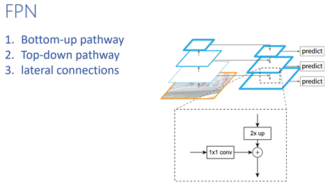
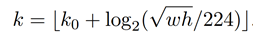

# FPN 原理与实现

## FPN(feature pyramid network)分析

FPN主要实现了特征金字塔模型，利用深度网络多个stage的feature map作为base feature，利用bottom-up pathway, top-down pathway 和lateral connections三部分组成最终的feature进行物体检测。
在FPN原文中，RPN部分和Fast RCNN部分都用了FPN。

### RPN
原始的RPN中是在单尺度的feature map上进行滑窗，然后通过1个head（包括3*3卷积+2个并联的1*1卷积）分别用于分类和回归。FPN版RPN中则把原来的单尺度feature map换成金字塔的feature map，然后在每一层特征金字塔上分别连接1个head做预测。
由于head会在所有金字塔层级进行密集的滑窗，因此不再需要多尺度的anchors，我们只在每个金字塔层级给定单个anchor。以resnet为例，对应于C2，C3，C4，C5的feature map分别构造金字塔的feature map为P2，P3，P4，P5，P6, 其anchor的尺度分别为32，64,128,256,512。（这里多了一个P6，它只是为了cover更大的anchor scale 512而引入的，它是P5的下采样。）另外，我们还是定义了3个aspect ratio{1:2,1:1,2:1}，这样在金字塔中一共就有15个anchor了。

### Fast RCNN
原始的Fast RCNN中使用的ROI pooling是在单尺度的feature map上对不同大小的ROI区域做相同的pooling。使用FPN后，则会在不同层的feature map上进行ROI pooling。具体在哪一层进行pooling由下式决定，表示将一个w*h的ROI（指在原输入图片上的大小）指给Pk层来进行ROI pooling。

其中224是标准的imagenet pre-training的大小，k0指的是一个224*224大小的ROI应该被map到的金字塔层级。faster rcnn中使用resnet的C4作为单尺度的feature map来做roi pool，所以我们在这里把k0设为4。
通过ROI pooling提取7*7的特征后输入到head里去做预测，( head表示的是类别分类器和bbox回归器), 这里的head使用了两个1024维的FC层（每个后接ReLU），这些层是随机初始化的。

## 简化版FPN
根据上面的分析，FPN需要实现gt roi到哪一层的筛选。我们将这一步忽略，直接在金字塔不同尺度的feature map上分别进行RPN和Fast RCNN，这样就省却了对generate_anchors.py / anchor_target_layer.py / proposal_target_layer.py / roi_pool.py等层的改写。

## 实现
整个repo位于：https://github.com/ataraxialab/faster_rcnn_pytorch
其中后缀名有FPN的说明进行了FPN相应的修改。

### 1 resnnet.py
https://github.com/ataraxialab/faster_rcnn_pytorch/blob/master/faster_rcnn/resnet_FPN.py

改写输出为FPN的形式，即将C2，C3，C4，C5的feature map都输出
在resnet类的forward函数中，加入如下代码:
https://github.com/ataraxialab/faster_rcnn_pytorch/blob/dev/faster_rcnn/resnet_FPN.py#L155-L165

### 2 faster_rcnn.py

* 在faster rcnn的init函数中加入新的conv层，用于FPN中所需的conv1*1和conv3*3:
https://github.com/ataraxialab/faster_rcnn_pytorch/blob/dev/faster_rcnn/faster_rcnn_resnet152_imgsize600_FPN.py#L178-L194

* 在faster rcnn的forward函数中加入构建金字塔feature map的部分，具体地就是通过C2,C3,C4,C5的feature作为bottom-up pathway的feature,将其通过1*1 conv得到lateral feature,与C3,C4,C5的feature经过upsampling以后的top-down pathway feature相加，得到金字塔的feature map:P2,P3,P4,P5.
https://github.com/ataraxialab/faster_rcnn_pytorch/blob/dev/faster_rcnn/faster_rcnn_resnet152_imgsize600_FPN.py#L216-L247

*	将这些层分别输入到RPN中，提取对应层级的roi。注意，这里每一层的anchor scale只要一个即可。另外，和之前有所不同，rpn的传入参数有所变化，从image变成了feature,并且加入了anchor_scales和_feat_stride两个用于generate anchor的参数。
https://github.com/ataraxialab/faster_rcnn_pytorch/blob/dev/faster_rcnn/faster_rcnn_resnet152_imgsize600_FPN.py#L255-L258

* 在之后的proposal target layer部分，也是分别传入进行计算：
https://github.com/ataraxialab/faster_rcnn_pytorch/blob/dev/faster_rcnn/faster_rcnn_resnet152_imgsize600_FPN.py#L262-L270

* 在roi pooling之后，不再使用res5层作为特征，而是接了两个全连接层
https://github.com/ataraxialab/faster_rcnn_pytorch/blob/master/faster_rcnn/faster_rcnn_resnet152_imgsize600_FPN.py#L309-L318

* 合并多层的cls_prob,bbox_pred,rois：
https://github.com/ataraxialab/faster_rcnn_pytorch/blob/dev/faster_rcnn/faster_rcnn_resnet152_imgsize600_FPN.py#L278-L280

*	最后，计算loss的时候为了打印log，需要把多层的tp,tf,fg_cnt,bg_cnt进行相加
https://github.com/ataraxialab/faster_rcnn_pytorch/blob/dev/faster_rcnn/faster_rcnn_resnet152_imgsize600_FPN.py#L282-L296

### 3 network.py
Load pretrained参数的时候和之前稍微有所不同：
https://github.com/ataraxialab/faster_rcnn_pytorch/blob/dev/faster_rcnn/network_FPN.py#L85-L91
