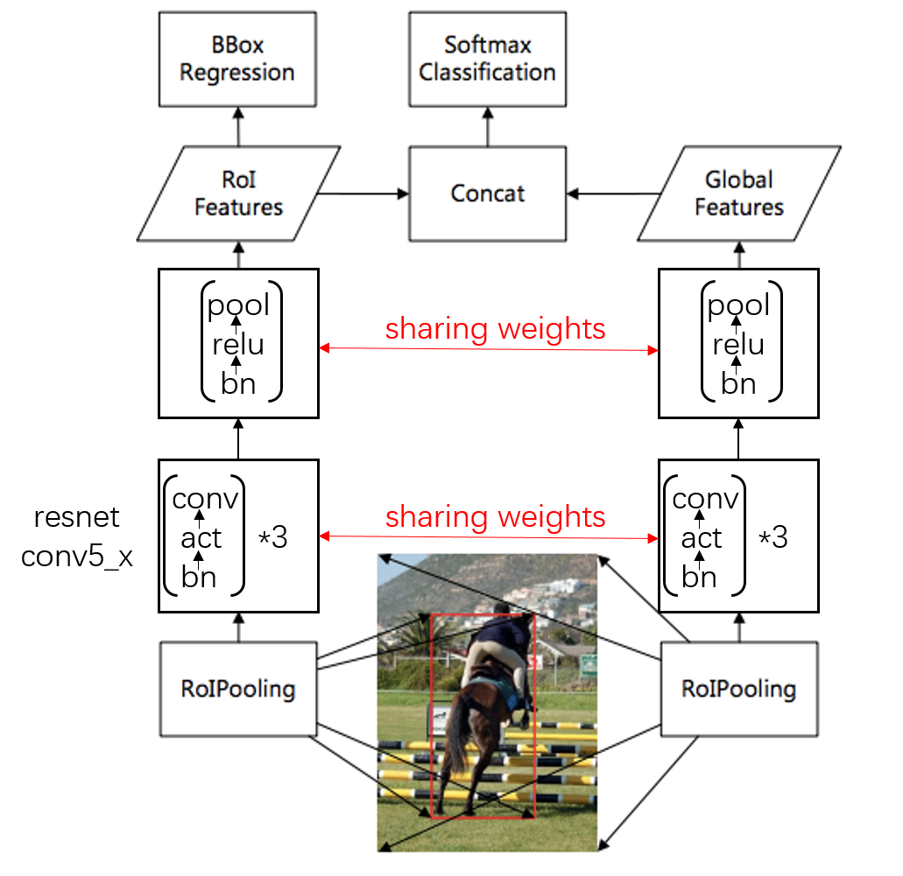
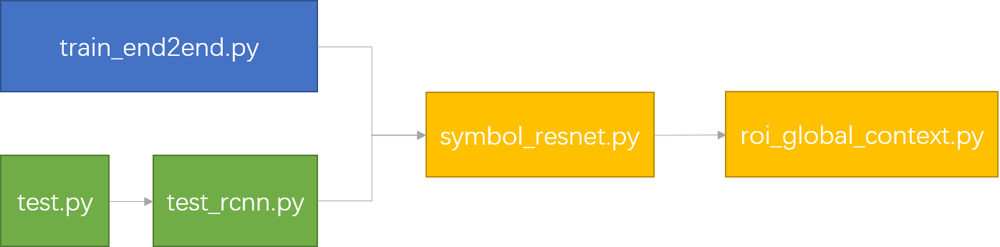

## Global Context
利用roi周围的一圈context信息帮助进行物体的分类。

## Global Context 代码分析
需要修改的代码结构如下图所示，roi_global_context.py主要实现上图中两个分支的特征concat的功能；symbol_resnet主要实现weight sharing的功能。其他还有一些更改如初始化权值等在train/test.py中实现。

### roi_global_context.py
1. forward的过程输入为roi，输出为增加一圈context后的roi。其中roi的context scale为输入配置参数。另外还需对增加context后超出原图像区域的roi进行裁剪。  
2. 不进行backward。

reference:
https://github.com/ElaineBao/mxnet/blob/master/example/rcnn/rcnn/symbol/roi_global_context.py#L16-L60

### symbol_resnet.py
增加sharing weight的部分。mxnet中对于权值共享的实现比较复杂。
首先需要把需要共享的权值定义出来：  
https://github.com/ElaineBao/mxnet/blob/master/example/rcnn/rcnn/symbol/symbol_resnet.py#L14-L46

然后再在对应使用的地方传入进去：
https://github.com/ElaineBao/mxnet/blob/master/example/rcnn/rcnn/symbol/symbol_resnet.py#L48-L72

### train/test.py
对于mxnet来说，网络结构的定义和数据、权重等是分离开的。  
对于需要共享权值的部分网络，如conv层的weight,bn层的gamma,beta等已经在定义结构的时候-symbol_resnet.py中定义了对应关系。但是还有另外一些参数，如bn的running mean、running var等状态变量也需要共享，它们无法在网络结构中定义，因此在train/test.py中进行定义。  
https://github.com/ElaineBao/mxnet/blob/master/example/rcnn/train_end2end.py#L87-L102