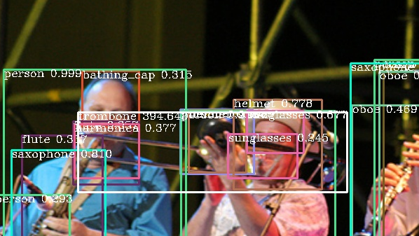
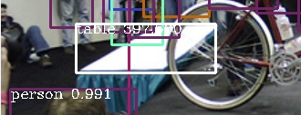

# Region Miss Analysis

## 检查漏检Region
* 画出来的框中，白色的框为所有的region proposal 的框均没有检测到的框(IOU < 0.5)
* 试着分析漏检的框的类型，例如

|类型|数目|例子|
|---|---|---|
|缺失严重|42/1000||
|光照变化|3/1000||
|边缘物体|79/1000||
|极小物体|225/1000||
|比例失调|44/1000||
|物体重叠|25/1000||
|严重形变|5/1000||

大家有新的类型可以添加到表格中
